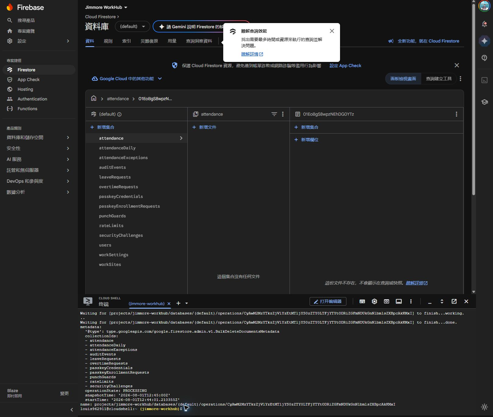
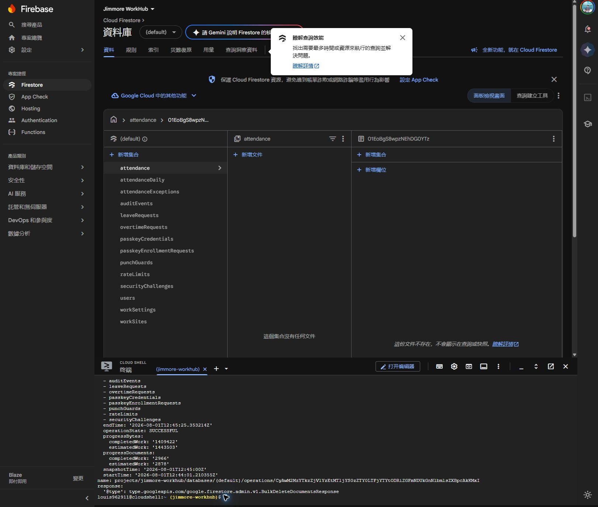
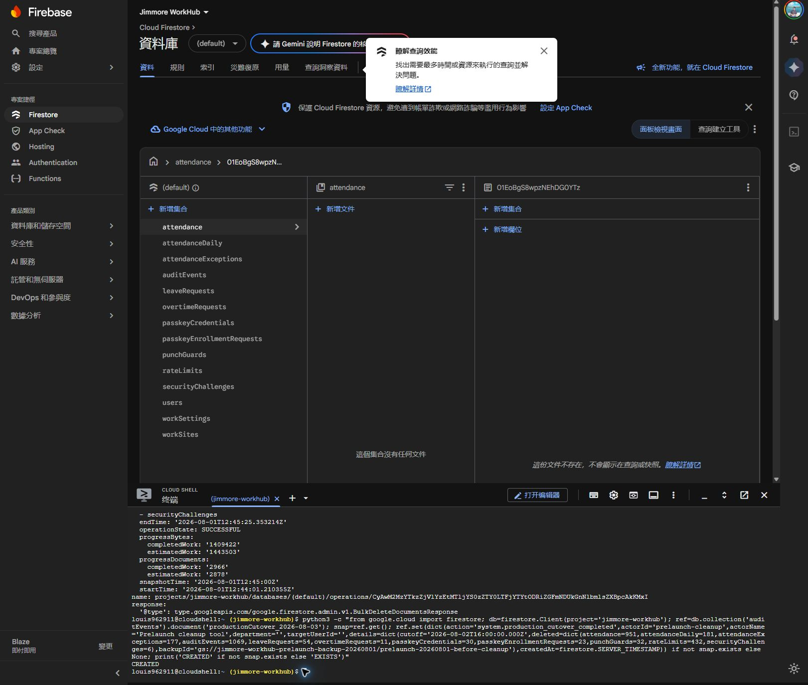
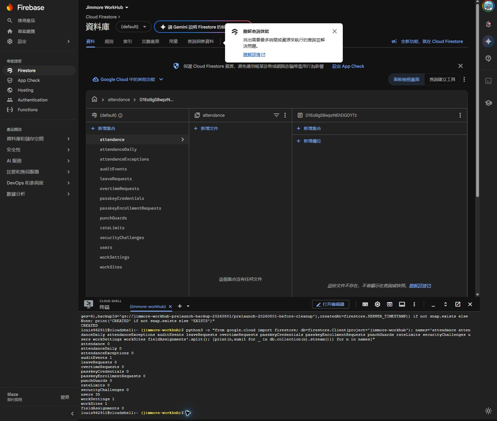
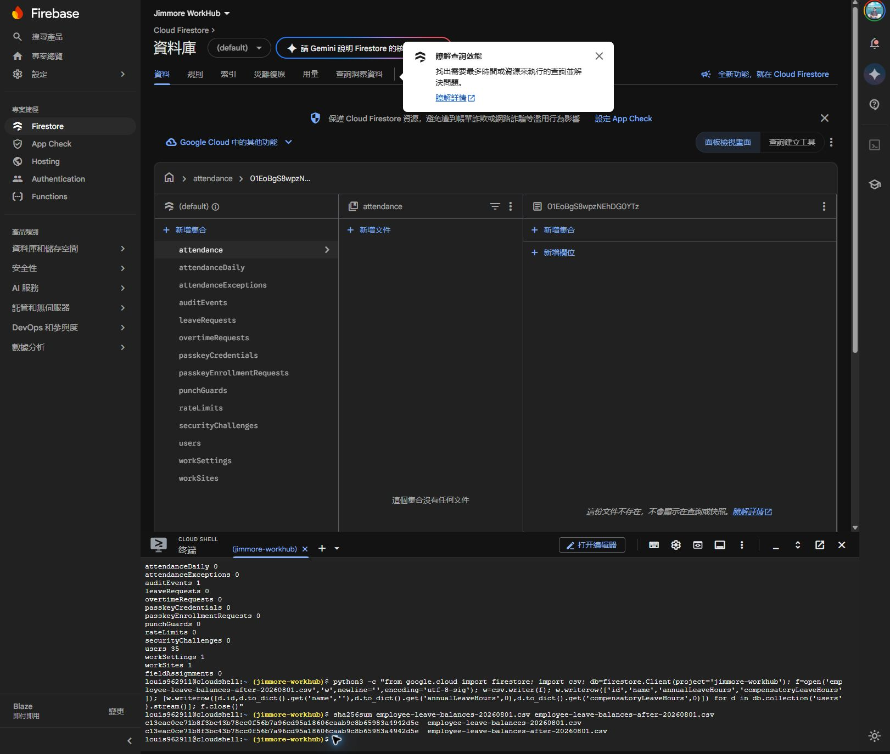
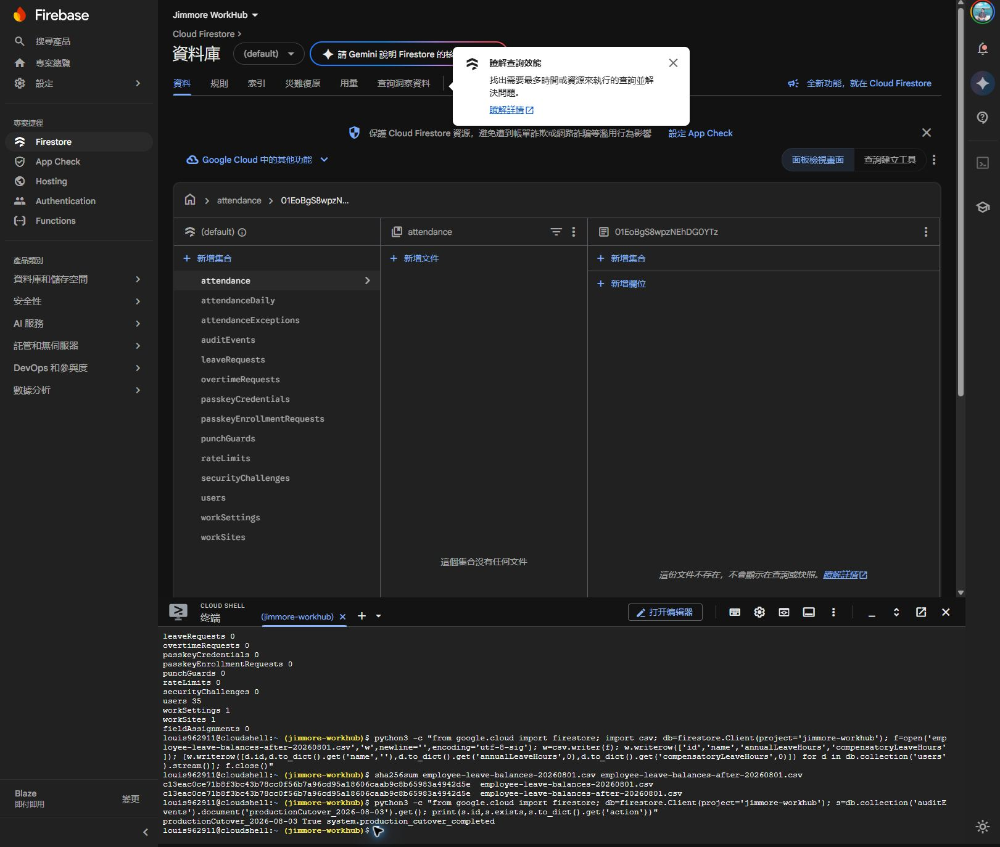

# Jimmore WorkHub 正式上線資料清理流程書

- 執行日期：2026-08-01（Asia/Taipei）
- 正式上線界線：2026-08-03 00:00（Asia/Taipei）
- Firebase 專案：`jimmore-workhub`
- Firestore 資料庫：`(default)`，位置 `asia-east1`
- 執行結果：成功永久刪除 2,966 筆測試文件

## 1. 清理範圍

| 集合 | 清理前 | 清理後 |
|---|---:|---:|
| `attendance` | 951 | 0 |
| `attendanceDaily` | 181 | 0 |
| `attendanceExceptions` | 177 | 0 |
| `auditEvents` | 1,069 | 1（上線起點事件） |
| `leaveRequests` | 54 | 0 |
| `overtimeRequests` | 11 | 0 |
| `passkeyCredentials` | 30 | 0 |
| `passkeyEnrollmentRequests` | 23 | 0 |
| `punchGuards` | 32 | 0 |
| `rateLimits` | 432 | 0 |
| `securityChallenges` | 6 | 0 |

保留集合沒有參與刪除：`users` 35 筆、`workSettings` 1 筆、`workSites` 1 筆、`fieldAssignments` 0 筆。Firebase Authentication 帳號也未變更。

## 2. 清理前備份

先在台灣 `asia-east1` 建立非公開的 Cloud Storage bucket：

`gs://jimmore-workhub-prelaunch-backup-20260801`

Firestore 3,003 份文件已匯出至：

`gs://jimmore-workhub-prelaunch-backup-20260801/prelaunch-20260801-before-cleanup`

備份內容包括 Firestore 原生匯出資料、中繼資料，以及逐員餘額檔 `employee-leave-balances-20260801.csv`。

清理前餘額 CSV 的 SHA-256：

`c13eac0ce71b8f3bc43b78cc0f56b7a96cd95a18606caab9c8b65983a4942d5e`

## 3. 永久刪除

取得使用者明確確認「確認刪除 2966 筆測試資料」後，透過 Google Cloud Firestore bulk delete 一次指定 11 個集合。未指定 `users`、`workSettings`、`workSites`、`fieldAssignments`，所以這些集合不會被刪除。

作業 ID：

`projects/jimmore-workhub/databases/(default)/operations/CyAwM2MzYTkzZjVlYzEtMTljYS0zZTY0LTFjYTYtODRiZGFmNDUkGnNlbmlsZXBpcAkKMxI`

後台最終回報：`operationState: SUCCESSFUL`、`completedWork: 2966`。

## 4. 建立正式上線稽核起點

清空舊 `auditEvents` 後，建立固定文件：

- 文件 ID：`productionCutover_2026-08-03`
- action：`system.production_cutover_completed`
- actorId：`prelaunch-cleanup`
- cutoff：`2026-08-02T16:00:00.000Z`（即台北時間 2026-08-03 00:00）
- details：包含各集合刪除筆數與備份位置

建立時終端回傳 `CREATED`。

## 5. 清理後驗證

重新讀取全部目標與保留集合：

- 10 個交易／暫存集合皆為 0。
- `auditEvents` 僅有 1 筆正式上線起點事件。
- `users` 仍為 35 筆。
- `workSettings` 仍為 1 筆。
- `workSites` 仍為 1 筆。
- `fieldAssignments` 仍為 0 筆。

再匯出清理後的 35 位員工假別餘額，清理前後 SHA-256 都是：

`c13eac0ce71b8f3bc43b78cc0f56b7a96cd95a18606caab9c8b65983a4942d5e`

這表示員工姓名、特休時數與補休時數逐位元完全一致。

最後直接讀取固定稽核文件，確認結果為：

`productionCutover_2026-08-03 True system.production_cutover_completed`

固定文件 ID 搭配「存在即不重建」的邏輯，可避免重複產生第二筆上線事件。

## 6. 如何查看與回復備份

在 Google Cloud Console 進入 **Cloud Storage → Bucket → `jimmore-workhub-prelaunch-backup-20260801` → `prelaunch-20260801-before-cleanup`**。

Firestore 原生備份的入口檔為：

`prelaunch-20260801-before-cleanup.overall_export_metadata`

如需回復，必須先確認回復目的地與集合範圍，再使用 Firestore import；不可在正式環境未確認時直接整批匯入。

